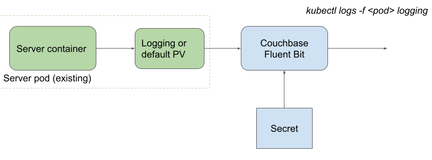
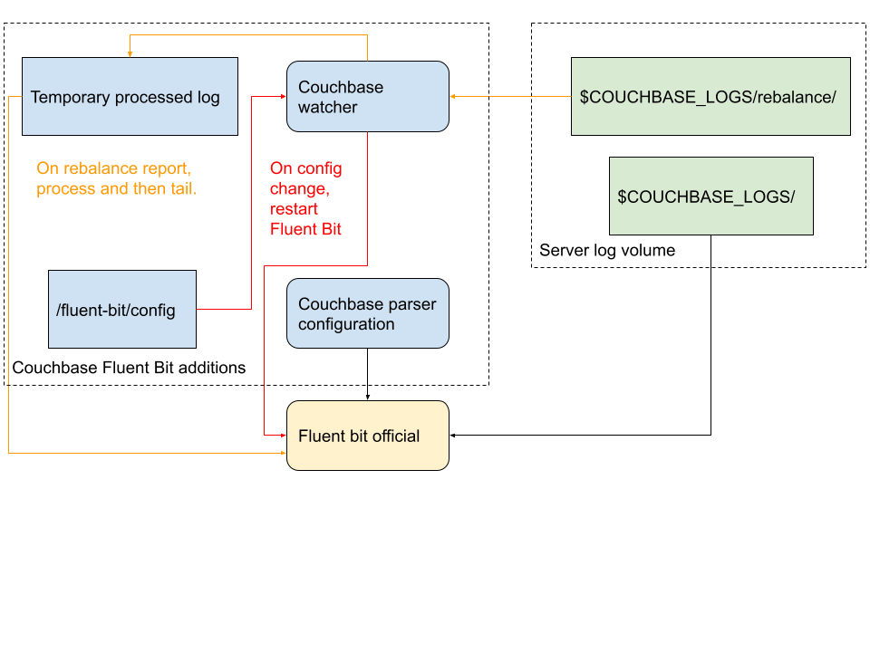

# couchbase-fluent-bit

## Summary

The Couchbase Fluent Bit image is an image based on the official [Fluent Bit](https://fluentbit.io/) [image](https://hub.docker.com/r/fluent/fluent-bit/) with some additional support for the following:
1. Dynamic configuration reload - changes to the configuration are watched for and when detected trigger a restart of Fluent Bit to pick up the new configuration.
2. Rebalace report pre-processing - the rebalance reports produced by Couchbase need some additional pre-processing before they can be parsed by Fluent Bit.
3. SHA1 LUA hashing implementation and redaction support included (but not enabled by default).

This image is intended to be used as a sidecar with a Couchbase Autonomous Operator deployment to automatically stream various couchbase logs.
The log streaming can be dynmically configured per namespace/Couchbase cluster via a standard Kubernetes secret which is mounted then as the configuration directory.

At this time, the image is only officially tested on Kubernetes in conjunction with the Couchbase Autonomous Operator.
However, nothing has been added to the image that explicitly prevents it from being run in non-Kubernetes environments.
Fluent Bit itself supports various deployment options so refer to its documentation for details.

To help provide the capability in this image we make use of other OSS:
* https://github.com/kubesphere/fluent-bit
* https://github.com/mpeterv/sha1
* https://github.com/fluent/fluent-bit



### Logs supported

Refer to the [official documentation](https://docs.couchbase.com/server/current/manage/manage-logging/manage-logging.html#log-file-listing) for all possible logs output by Couchbase Server.

This image is used to parse and send the following logs to standard output by default:
* analytics_debug.log
* audit.log
* babysitter.log
* couchdb.log
* debug.log
* eventing.log
* fts.log
* goxdcr.log
* http_access.log
* http_access_internal.log
* indexer.log
* json_rpc.log
* mapreduce_errors.log
* memcached.log
* metakv.log
* ns_couchdb.log
* projector.log
* prometheus.log
* Rebalance reports
* reports.log

It will also handle the logs like `info.log`, `error.log` that are a subset of the full `debug.log` - there is no point parsing all these logs as it will duplicate the information.

The definition of "parse" here means to turn the unstructured, possibly multi-line log output into structured data we can filter, mutate & forward to any supported Fluent Bit endpoint.
For the purposes of this image, we essentially chunk up the log lines into timestamp, level and message - message can be over multiple lines.
As an example (taken from `tests/logs/memcached.log.000000.txt`):
`2021-03-09T17:32:01.859344+00:00 INFO Couchbase version 6.6.0-7909 starting.`
Will become (taken from `tests/logs/memcached.log.000000.txt.expected`):
`[1615311121.859344000, {"filename":"/fluent-bit/test/logs/memcached.log.000000.txt","timestamp":"2021-03-09T17:32:01.859344+00:00","level":"INFO","message":"Couchbase version 6.6.0-7909 starting."}]`
This is a structured stream made up of various fields which can be sent to any supported output (multiple potentially and/or different to other logs):
* `"timestamp":"2021-03-09T17:32:01.859344+00:00"`
* `"level":"INFO"`
* `"message":"Couchbase version 6.6.0-7909 starting."`

Every log is tagged individually to form its own stream within the log shipper.
The tag format is `couchbase.log.<name>`.
Each stream can be managed independently so refer to the official Fluent Bit documentation for full details on the extensive capability and configuration available.

Other logs than the list above may be supported by the provided parsers as well.

## Technical Overview

This image is essentially the official Fluent Bit image with an entrypoint watcher process that handles both restarting Fluent Bit on config change and pre-processing the rebalance reports.



### Parsing
For the purposes of this implementation, parsing is very simple as we’re not trying to extract any more information than the simple timestamp, log level and log message.
A few of the logs (http and JSON format ones - audit & rebalance reports) can have some extra fields extracted as it is straightforward but any significant processing is left for the consumer to manage.

The intention is to keep it as simple as possible and produce a structured log stream that can be filtered or consumed with further processing downstream as required.

For those logs with multiline output, the parser should capture everything up to the next log statement. In some cases this includes large content (e.g. Java thread dumps) but this is all treated as part of the log message for the consumer to work with.

The parsers are provided in `conf/parsers-couchbase.conf` along with default configuration for each log file in `conf/couchbase/in-*.conf`.
We use a separate config file per input type/parser configuration (log file type) to make is simpler to reuse for a custom configuration either in testing or by end users.

### Rebalance reports and dynamic configuration
The official version of Fluent Bit does not support dynamic changes to its configuration: if you change the log shipping configuration then you have to restart it.
We cannot restart the pods without triggering rebalance.

The rebalance reports have a bit of an issue with the default tail plugin: they are a file with no new lines.
The full JSON dump of the report is all over a single line which can be quite large (not for a log file but for a single line in a log file).
The tail plugin works on a per-line basis so cannot handle the reports as they currently are.
Additionally there is the question of which timestamp to use as the “log” timestamp - a rebalance report can have multiple ones using common tags.

We have solved both these problems by forking the Kubesphere solution (a fork from the official image) to resolve the dynamic configuration issue.
This watches for config file changes and then restarts Fluent Bit to pick up the new configuration but all within the container.
We can extend this to handle the rebalance reports: we watch for them, when we see one we copy it to a temporary location with any pre-processing we want done and then Fluent Bit reads the copy.
We copy it for these reasons rather than updating in place:
1. No change to the original log or anything reliant on it (e.g. rotation).
2. The logging sidecar deliberately has no write access to the log volume so it cannot modify any logs.
3. The log timestamp can be collected from the rebalance report name which includes the time it was created.

Whilst Fluent Bit is restarting, no logs will be shipped out of the container.
We could re-parse logs but this would then lead to duplicate entries from previously parsed logs.
The intention is that reconfiguration is an asynchronous un-common operation so the temporary potential loss of logs is acceptable.

Interestingly as part of this work, we discovered that the `exec` plugin is not usable in a container without `/bin/sh`, i.e. all the official ones including the debug variant with busybox.
The original intention was to use this to process the log file but that was impossible: even with a compiled binary it still must be invoked via `/bin/sh`.

### Redaction
Log redaction in flight has been demonstrated and is tested but will not be provided by default.

A tutorial is provided on how to configure this if required so refer to the Couchbase Autonomous Operator documentation for that.
There may be a performance impact to redaction in flight and it will also complicate debugging of problems if the logs are auto-redacted within the cluster.

To simplify usage we build everything required into the container image: this is a minimal image so has no support for hashing out of the box.
we therefore include the LUA implementation from: https://github.com/mpeterv/sha1 .
Lua provides the best approach to dealing with redaction anyway so attaching a Lua hashing library made the most sense.

Similarly any other log mutation could be done that is supported by Fluent Bit.
Using a LUA script provides a lot of flexibility but there are plenty of other simpler plugins to modify the content or destination of a log.
The recommendation when using LUA parsing is to dedicate a worker thread to it.

### Specific parser information

Each of these sections references the specific parser set up in conf/parsers-couchbase.conf.

#### couchbase_json_log_nanoseconds and couchbase_rebalance_report
These are both JSON parsers so support a full JSON extraction/forwarding.
There is no need to match lines in a legacy way with a regex.

#### couchbase_http
The HTTP parsers reuse the default Fluent Bit Apache2 regex with some minor changes.
This means they do not provide a simple triplet of timestamp, level, message but instead include various fields from the message instead.

#### couchbase_simple_log_mixed
Some of the logs (FTS and eventing in the default configuration) provide a mixed timestamp output which is difficult to parse in one go.
```
2021/03/09 17:32:15 cbauth: ...
2021-03-09T17:32:15.303+00:00 [INFO] ...
```
Instead the timestamps are extracted via a generic parser and then could be run through an additional stage to parse it in the appropriate format.
This may not be required if it is acceptable as per the default configuration to use local time, i.e. the time at which Fluent Bit tails that line in the log.

#### couchbase_erlang_multiline
The multi-line erlang parser originally parsed everything after the square bracket as the message.
Unfortunately the regex parser does not seem to like a new line immediately after the bracket - with some text first then a new line it works fine.
Therefore the message includes everything after the timestamp, this guarantees we get all multiline output and also anything else after timestamp.

## Usage

The official Couchbase Autonomous Operator documentation provides full details on using this with Kubernetes including additional tutorials on consuming logs with Loki or sending to Azure, S3, etc.

The image is basically identical to the official Fluent Bit image and can be used in the same fashion.
If the capabilities listed above are not required then the official Fluent Bit image can be used as well.

This image is only intended to be used with Kubernetes although it may be usable as a standalone Docker image either for a containerised or on-premise deployment but this is not an officially supported configuration.

An example local configuration running three Couchbase nodes using docker-compose:
```
version: "3.9"
services:
    couchbase-server1:
        container_name: db1
        image: couchbase:7.0.1
        ports:
          - "8091-8096:8091-8096"
          - "11210-11211:11210-11211"
        volumes:
          - log-volume:/opt/couchbase/var/lib/couchbase/logs/:rw
    couchbase-server2:
        container_name: db2
        image: couchbase:7.0.1
        expose:
            - "8091-8096"
            - "11210-11211"
    couchbase-server3:
        container_name: db3
        image: couchbase:7.0.1
        expose:
            - "8091-8096"
            - "11210-11211"
    log-streamer:
        container_name: logging
        image: couchbase/fluent-bit:1.1.0
        depends_on:
            - couchbase-server1
        environment:
            - COUCHBASE_LOGS=/opt/couchbase/var/lib/couchbase/logs
        volumes:
          - log-volume:/opt/couchbase/var/lib/couchbase/logs/:ro
volumes:
    log-volume:
```
The volume could be replaced with a bind mount for an on-premise Couchbase Server deployment - and the container could be run directly with a container runtime rather than docker-compose (as per Testing example below.) Couchbase Server will need configuration when it starts up above - it currently does not support a declarative model to auto-provision the containers on startup.

Note that this image copes with multi-line input logs but the default output to standard output will still be over multiple lines for these same messages.
This means if you are collecting this information with a Daemonset (e.g. another Fluent Bit or PromTail) reading the container logs (from standard output) then you will need to capture multi-line output.
It will all be inside a standard [`msgpack`](https://msgpack.org/) Fluent Bit record format though so can be parsed that way.

A full example local [Loki](https://grafana.com/docs/loki/latest/overview/) stack deployment (Loki+Grafana - configured) is also provided in the [tools/loki-stack](tools/loki-stack/) directory, this can be run via a simple `docker compose up` command.
The Grafana instance will then be exposed via `localhost:3000`.
This also supports a blog post showing how to do this in detail: https://blog.couchbase.com/using-fluent-bit-for-log-forwarding-processing-with-couchbase-server/

### Configuration

| Environment variable | Description | Default |
| --- | --- | --- |
| COUCHBASE_FLUENT_BIT_CONFIG | The directory containing the Couchbase (or other) configuration files, primarily used for dynamic output configuration. | /fluent-bit/etc/couchbase |
| COUCHBASE_LOGS | The directory in which to find the various Couchbase logs we are interested in. | /opt/couchbase/var/couchbase/logs |
| COUCHBASE_LOGS_BINARY | The Fluent Bit binary to launch. | /fluent-bit/bin/fluent-bit |
| COUCHBASE_LOGS_CONFIG_FILE | The config file to use when starting Fluent Bit. | /fluent-bit/config/fluent-bit.conf |
| COUCHBASE_LOGS_DYNAMIC_CONFIG | The directory to watch for config changes and restart Fluent Bit. | /fluent-bit/config |
| COUCHBASE_LOGS_REBALANCE_TEMPDIR | The temporary directory for out pre-processed rebalance reports. | /tmp/rebalance-logs |
| COUCHBASE_K8S_CONFIG_DIR | The location where [DownwardAPI](https://kubernetes.io/docs/tasks/inject-data-application/downward-api-volume-expose-pod-information/) pushes pod meta-data to load as environment variables. | /etc/podinfo |
| LOKI_HOST | The hostname used by the Loki output plugin (if enabled). | loki |
| LOKI_MATCH | The set of matching streams to send to Loki. | no-match (prevents any) |
| LOKI_PORT | The port used by the Loki output plugin (if enabled). | 3100 |
| HTTP_PORT | The port used for the HTTP server run by Fluent Bit (enabled by default). | 2020 |
| STD_MATCH | The set of matching streams to send to standard output. | couchbase.log.* |

Be careful to make sure you have enough file descriptors configured to use this functionality, particularly for local development with something like Kubernetes-In-Docker(KIND).

### CAO and K8S labels

The Couchbase Autonomous Operator (CAO) automatically pushes all pod labels & annotations into the container via the [DownwardAPI](https://kubernetes.io/docs/tasks/inject-data-application/downward-api-volume-expose-pod-information/).
These are then loaded as environment variables by the Couchbase watcher process so this can be a very useful way to pass configuration into a container.

In addition, any variables that start with the `fluentbit.couchbase.com/` have some additional processing applied: the prefix is removed and everything left is upper-cased plus special characters replaced with underscores.

`fluentbit.couchbase.com/loki_host: loki.monitoring` will therefore provide `LOKI_HOST=loki.monitoring`.

User-defined labels and annotations can be specified with CAO via the pod template.

### Output plugin dynamic enabling

By default we only output to standard output but other output plugins are included they just do not match any existing streams.
It is possible to enable matching of streams to output plugins via the `<PLUGIN>_MATCH` environment variable.
For example to enable sending all logs to Loki, set `LOKI_MATCH="*"`.
Refer to the [default configuration](./conf/fluent-bit.conf) to see which output plugins are enabled.

The major benefit of this for CAO deployments is we only need to have user-defined labels like so to set up Loki usage:
```
      pod:
        metadata:
          annotations:
            fluentbit.couchbase.com/loki.match: "*"
            fluentbit.couchbase.com/loki.host: loki.monitoring
```

## Building

This repository is set up to be built by the internal Couchbase process with a `Makefile`.
This can be easily reused though to build locally either by installing the relevant tools or using a Golang container to build the source.

## Testing

A set of automated tests are provided to verify changes against for sanity checks and some regression testing too of known input and expected output.
New sets of input data can be used as well by running the container with the logs (input) and expected output using a volume mount:
```
docker run --rm -it --mount type=bind,source=<directory>,target=/fluent-bit/tests/logs <test container name>
```
The directory should be made up of matching pairs of logs and expected output in the following format: `<name>.log` --> `<name>.log.expected`.
The container will run the Couchbase Fluent Bit image against each log file in turn with some basic sanity checks and produce an output file named `<name>.log.actual`.
The `tests/run-tests.sh` script will then iterate over all expected output to compare it against actual output.

To help with verifying new output, a simple NodeJS tool is provided in `tools/log-verifier`.
This can be run locally or as an image against the files to check, when run as an image the file will need mounting into the container and passing as an argument.

For the Red Hat variant we make best effort to verify Fluent Bit however the only supported usage is of the `tail` input plugin to `stdout` output plugin pipeline used in the default configuration for the Couchbase Autonomous Operator. The Red Hat test container includes the unit tests which can be run manually as required to verify changes.

## Feedback
Please use our official [JIRA board](https://issues.couchbase.com/projects/K8S/issues/?filter=allopenissues) to report any bugs and issues with the `logging` component.
We also encourage you to use the [Couchbase Forums](https://forums.couchbase.com/c/couchbase-server/Kubernetes) for posting any questions or feedback that you might have.

## Support
As indicated above, Couchbase only supports the use of this image when used with the Couchbase Autonomous Operator.
Specificially, the default configuration provided by the operator and the ability to provide a custom configuration is supported.
Best efforts are made to confirm that custom configurations will work with various plugins but any issues with the custom configuration, plugins or other components are outside of the supported scope.

### Compatibility matrix for CAO

CAO = Couchbase Autonomous Operator
CFB = Couchbase Fluent Bit

| CAO Version  | CFB Version -> | 1.0.0 | 1.0.1 | 1.0.2 | 1.0.3 | 1.0.4 | 1.1.0 | 1.1.1 | Next (1.1.2) |
|--------------|----------------|-------|-------|-------|-------|-------|-------|-------|--------------|
| 2.2.0        |                | X     | X     | X     | X     | X     |       |       |              |
| 2.2.1        |                | X     | X     | X     | X     | X     | X     | X     | X            |
| Next (2.3.0) |                |       |       |       |       | X     | X     | X     | X            |

## Release tagging and branching
Every release to DockerHub will include a matching identical Git tag here, i.e. the tags on https://hub.docker.com/r/couchbase/fluent-bit/tags will have a matching tag in this repository that built them.
Updates will be pushed to the `main` branch often and then tagged once released as a new image version.
Tags will not be moved after release, even just for a documentation update - this should trigger a new release or just be available as the latest version on `main`.

The branching strategy is to minimise any branches other than `main` following the standard [GitHub flow model](https://guides.github.com/introduction/flow/).

## Releases

A quick summary of each release is given below to help understand the changes.
For full details have a look at the diff of the tags and associated commits for each: https://github.com/couchbase/couchbase-fluent-bit/releases/tag/

* main - in progress for next release (1.1.2)
  * Updated to Go 1.17.1 - this relates to the internal Watcher code layered on top of Fluent Bit.
  * Additional configuration variables now available for [Loki output and the HTTP server](https://issues.couchbase.com/browse/K8S-2354).
  * New support for enabling output plugins via environment variables fed in from [Kubernetes labels or annotations](./tools/loki-k8s-stack/values.yaml).
  * Updated to Fluent Bit [1.8.8](https://www.fluentbit.io/announcements/v1.8.8/).
* 1.1.1
  * Updated to Fluent Bit [1.8.7](https://www.fluentbit.io/announcements/v1.8.7/).
  * Updates to [support on-premise usage with rotated memcached logs](https://issues.couchbase.com/browse/K8S-2343).
  * Resolve issue with [missing version information in the output](https://issues.couchbase.com/browse/K8S-2355).
  * Updated [loki stack example](tools/loki-stack/) to handle changes to user security preventing log file reading.
  * Added support for [mapreduce_errors.log](https://issues.couchbase.com/browse/K8S-2426) parsing.
  * Added [test for rebalance output](https://issues.couchbase.com/browse/K8S-2394) being present.
  * Added `level_numeric` field for a [numeric value for the log level](https://issues.couchbase.com/browse/K8S-2402) to simplify querying downstream.
* 1.1.0
  * Updated to Fluent Bit [1.8.2](https://www.fluentbit.io/announcements/v1.8.2/).
    * Matching change in versions here, 1.0.4 --> 1.1.0.
  * Added [version information into records](conf/couchbase/filter-add-common-info.conf).
  * Ensures log `level` is always one of `DEBUG, INFO, WARN, ERROR, UNKNOWN` and maintains the original value if not one of these as `original_level`, e.g. `"original_level":"audit","level":"UNKNOWN"`.
  * Splits `Path_Key` (`filename`) into `path` & `file` keys to make it easier to filter on downstream, e.g. `"file_path":"/fluent-bit/test/logs","file":"eventing.log","filename":"/fluent-bit/test/logs/eventing.log"`.
  * Tested against Couchbase Server 7.0.0, added parsing for new `prometheus.log`.
* 1.0.4
  * Switch to using `record_modifier` for [common info](conf/couchbase/filter-add-common-info.conf) so missing variables do not trigger an exit, just an error.
  * Removed Fluent Bit tests from running on every RHEL build: [issue](https://github.com/fluent/fluent-bit/issues/3520) with reliability so only run manually now on version change.
  * Git version information now included in log output.
  * Log entire environment at launch.
  * Supports redaction of the `log` key as well now for un-parsed logfiles.
  * Simple example showing how to implement a file-transfer service with the `forward` plugin.
  * Updated to Fluent Bit [1.7.8](https://www.fluentbit.io/announcements/v1.7.8/).
* 1.0.3
  * Disables auto-run of Fluent Bit unit tests during RHEL builds due to timing issue making them unreliable: https://github.com/fluent/fluent-bit/issues/3520
  * Added run-as numeric USER to support security improvements.
  * Copyright headers added to all source files along with CI checks to confirm it on every build.
  * Resolved race condition in unit tests for restarting.
* 1.0.2
  * Major refactor to move from single `main.go` file to Go module across packages with unit tests as well for each sub-component.
  * Update to Fluent Bit [1.7.4](https://www.fluentbit.io/announcements/v1.7.4/).
  * Linting and other CI improvements.
  * [Addition of extra common information](https://github.com/couchbase/couchbase-fluent-bit/blob/d474c83616f7444e3c627cb63d4fe021969073e6/conf/couchbase/filter-add-common-info.conf) as extra keys when run with the operator (pod and couchbase cluster information).
  * [Additional filters](https://github.com/couchbase/couchbase-fluent-bit/blob/d474c83616f7444e3c627cb63d4fe021969073e6/conf/couchbase/filter-handle-levels.conf) from observability work to standardise log levels for easy use with Grafana, along with [example output configuration](https://github.com/couchbase/couchbase-fluent-bit/blob/d474c83616f7444e3c627cb63d4fe021969073e6/conf/couchbase/out-loki.conf) and supporting documentation.
  * [Optional filter](https://github.com/couchbase/couchbase-fluent-bit/blob/d474c83616f7444e3c627cb63d4fe021969073e6/conf/couchbase/filter-common-problems.conf) to pick up examples of common problems, purely an initial example so not used by default.
  * Reduced refresh interval to pick up new log files to 10 seconds - previously was 60 seconds.
  * Enabled HTTP server by default to support metrics and healthchecks if required - on port 2020.
  * Explicit non-root USER support.
* 1.0.1
  * Minor licensing updates to pass Red Hat certification checks.
* 1.0.0
  * Initial release containing the various watchers and parsers.
  * Based on Fluent Bit [1.7.3](https://www.fluentbit.io/announcements/v1.7.3/).

## License

Copyright 2021 Couchbase Inc.

Licensed under the Apache License, Version 2.0

See [LICENSE](https://github.com/couchbase/couchbase-operator-logging/blob/master/LICENSE) for further details.